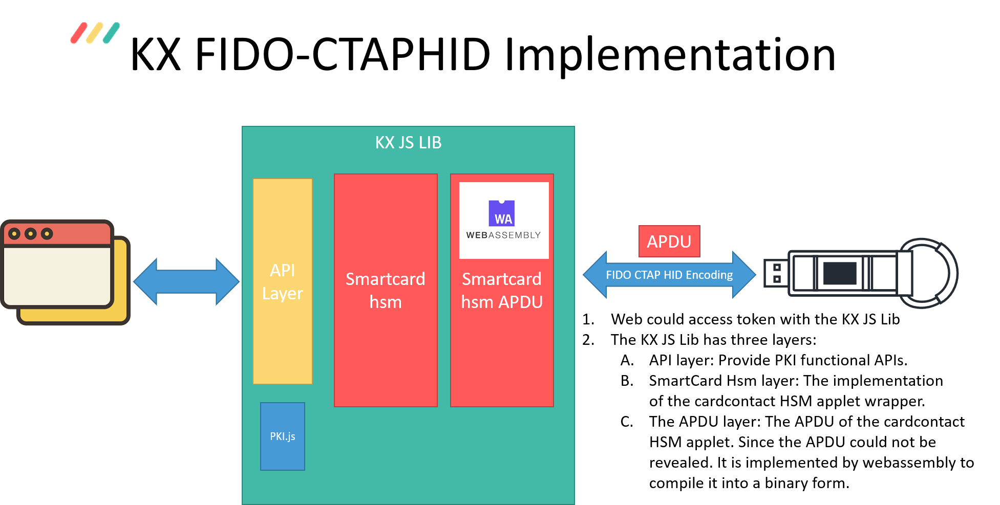

# ctapApduExchange

## Overview
This project is the demostration of the implementation of SmartCardHSM APDU exchange via the CTAP2 channel.<br>
The CTAP2 channel was used for the FIDO2 communication between the website and the FIDO2 token.<br>
The key idea is to embed vedor-specific commands inside the authenticatorGetAssertion command and retrieve the results from the response.<br>
To prevent from revealing the APDU of the SmartCardHSM applet, <br>the WebAssembly mechanism was applied to compile the implementation into a binary form.<br>
This project also implements the JavaScript access layer of the operations of the SmartCardHSM to serve as the futher encapsulation of the PKI operations.<br>
The implementation is equivalent to [KXSEAPDU.cpp](https://dev.keyxentic.com/Steven/KXSmartTokenSdk/-/blob/master/KXAPDUKit/KXSEAPDU.cpp) of the PC SDK<br>
It could be used to build an upper layer function just like the functions provided in [KX906SecureElement.cpp](https://dev.keyxentic.com/Steven/KXSmartTokenSdk/-/blob/master/KXSmartTokenSdk/KX906SecureElement.cpp).


## Implementation
* Architecture

* Memory model
The data exchange between the JavaScript and WebAssembly is based on shared-buffer mechanism using the Emscripten heap system. The JavaScript code would allocate a buffer, and if there's any data exchange needed, it would put data into this buffer and then call the WebAssembly functions. If there's any return data, the WebAssembly would also put the returned value in this buffer.
## Structure
.<br>
└── ctapapduexchange<br>
    ├── css: The css of the index.html<br>
    ├── js<br>
    │   ├── app.js: The example of how to use smartCardHsm.js<br>
    │   ├── platform.js: Some helper functions to detect platform<br>
    │   ├── smartCardHsm.js: The smartCardHsm javascript layer<br>
    │   ├── smartCardHsmConfig.js: Some constants used in the smartCardHsm<br>
    │   └── smartCardHsmError.js: Some constants used in the smartCardHsm<br>
    ├── wasm<br>
    │   ├── build.bat: the webassembly building script<br>
    │   ├── ctapApduExchange.js: The Javascript <br>
    │   ├── smartCardHsmApduDef.h: The webassembly C header file<br>
    │   ├── smartCardHsmApdu.c: The webassembly C source code<br>
    │   ├── smartCardHsmApdu.html: The internal html to test the js and wasm<br>
    │   ├── smartCardHsmApdu.js: The wrapper javascript to use the smarCardHsmApdu.wasm<br>
    │   └── smartCardHsmApdu.wasm: The built webassembly binary<br>
    └── index.html: Demo webpage<br>

## Dependency
* Emscripten
* Python(Python 3 is preferred)

## Build and Run the test
* Clone the project
* Install Emscripten (Refer to the installation guide below)
* Run the build.bat file (you may need to write your own build script if the build environment is not Windows)<br>If the terminal or console is closed, the Emscripten SDK environment would be destoryed. To setup the environment again, navigate to the Emscripten SDK folder and execute the emsdk_env script.
* Run the python command to start a simple web server.<br> You may need to use prots other than 8080 if it is occupied by other services on your computer
```console
foo@bar:~$ python -m http.server 8080
```
* Open your browser and navigate to http://localhost:8080/

## Limit
The APDU size is limited to 1024 bytes.

## Reference
* [Solo Key webupdate using the CTAP2 channel](https://github.com/solokeys/solo-webupdate)
* [Emscripten Installation](https://emscripten.org/docs/getting_started/downloads.html)
* [WASM tutorial from Emscripten](https://emscripten.org/docs/porting/connecting_cpp_and_javascript/Interacting-with-code.html)
* [WASM tutorial from Morzilla](https://developer.mozilla.org/en-US/docs/WebAssembly/C_to_wasm)
* [WASM tutorial](https://kapadia.github.io/emscripten/2013/09/13/emscripten-pointers-and-pointers.html)
* [WASM tutorial](https://marcoselvatici.github.io/WASM_tutorial/)
* [Emscripten Asyncify](https://emscripten.org/docs/porting/asyncify.html)
* [CPPWASM](https://github.com/3dgen/cppwasm-book)
